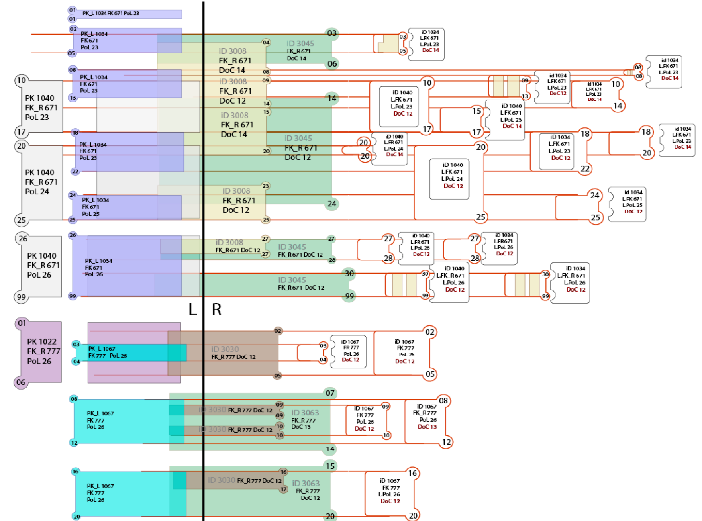

# ETL DWH - FK_DOCUMENT
SQL скрипт собирает витрину из слоя DWH за определенный период дат. Все документы собирают доп. поля на время своего существования.

### Тестирование таблицы с использованием синтетики и маппинга разработанного аналитиками

####  Инициализация таблицы DWH
* ```sinteticData.sql``` 

#### Описание
Трансформация документа из источника с рассчетом его срока действия, срок действия может прерываться (открываться и закрываться).

#### Использование
* Загрузить синтетику в таблицу SRC
* Просчитать/Прокрутить скрипты преобразования
* Загрузить синтетику выходных данных
* Выполнить скрипт стравнения таблиц и убедиться, что ошибок нет

#### Скриншоты
Внутренние измерения
<br/>


