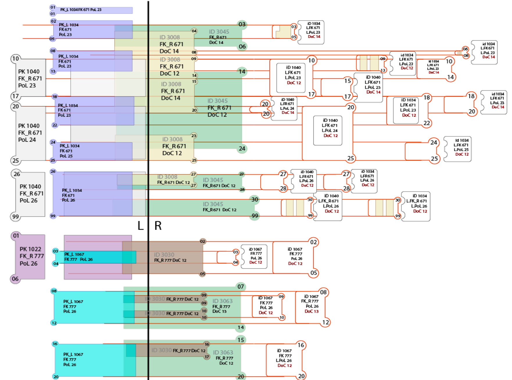

# ETL DWH Case: Аналитическая витрина FK_DOCUMENT

### 📊 Описание проекта
Реализация сложной ETL-трансформации для сборки аналитической витрины из слоев DWH. Проект демонстрирует навыки проектирования структур данных, обработки временных интервалов и автоматизации тестирования SQL-логики.

**Ключевая особенность:** Трансформация документа из источника с расчетом периодов его валидности. Логика поддерживает сценарии, где срок действия документа может прерываться (динамическое открытие и закрытие периодов).

---

### 🛠 Технические детали и задачи:
*   **Сборка витрины:** Формирование итогового слоя данных на основе срезов за определенные периоды.
*   **Обогащение данных:** Динамическое присоединение дополнительных полей к документам на всем протяжении их жизненного цикла.
*   **Обработка интервалов:** Реализация логики "открытия/закрытия" записей для корректного исторического анализа.

### 🧪 Верификация данных (QA Process):
Для обеспечения точности трансформации реализован процесс проверки на контрольных примерах:
1. **Подготовка данных:** Загрузка сформированной аналитиками синтетики в исходные таблицы DWH (`sinteticData.sql`).
2. **Трансформация:** Запуск основного скрипта преобразования и расчета жизненного цикла документов.
3. **Валидация:** Сравнение результирующей таблицы с эталонным маппингом (Output Mapping).
4. **Автоматическая сверка:** Выполнение скрипта сравнения таблиц для подтверждения отсутствия расхождений и логических ошибок.

---

### 💡 Почему это важно для Backend-инженера?
Работа с DWH на таком уровне показывает:
- Умение проектировать высоконагруженные и консистентные системы хранения.
- Понимание жизненного цикла данных и работы с временными рядами.
- Системный подход к тестированию бизнес-логики на уровне БД.

> **Статус проекта:** Инициализация структуры и логики ETL успешно протестирована на синтетических данных.

#### Скриншот схема
Внутренние измерения
 

